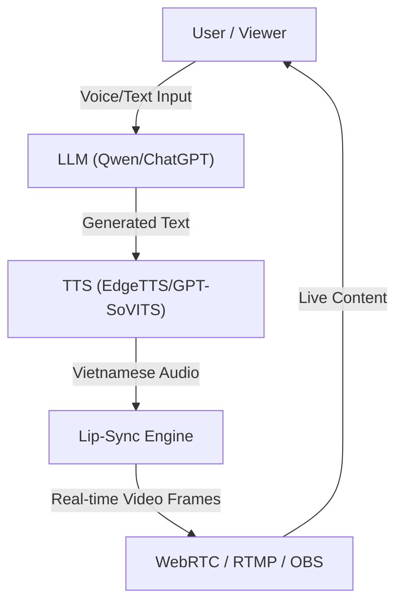

# 🎙️ LiveStream-Realtime: AI Digital Human for Livestreaming

> [!NOTE]
> **Acknowledgment:** This project is based on the amazing work by [lipku/LiveTalking](https://github.com/lipku/LiveTalking). Special thanks to the original author for their contribution to the open-source community.


<p align="center">
  
</p>

<p align="center">
    <a href="./LICENSE"></a>
    
    
    
    
</p>

---

## 🌟 Overview

**LiveStream-Realtime** is a high-performance, real-time digital human interaction system specifically optimized for **Livestreaming (TikTok, Shopee, OBS)**. It enables seamless voice-to-video synchronization with ultra-low latency, making it perfect for virtual streamers and AI-powered sales assistants.

### 🚀 Key Features for Livestreamers
*   **Real-time Interaction:** Ultra-low latency via **WebRTC** and **RTMP**.
*   **Vietnamese Voice Support:** Integrated with **Microsoft Edge TTS** (Hoài Mỹ, Nam Minh) and **GPT-SoVITS** for natural Vietnamese speech.
*   **OBS Integration:** Easily output to Virtual Camera or RTMP for broadcasting in OBS Studio.
*   **Interactive Interruptions:** AI stops talking immediately when the user speaks (Interrupt-enabled).
*   **Multiple Models:** Supports Wav2Lip, MuseTalk, and ERNeRF for different performance needs.
*   **Custom Avatars:** Use any video or image to create your own digital human.

---

## 🛠️ Quick Setup (Windows)

### 1. Installation
Ensure you have Python 3.10 and CUDA installed.

```bash
# Create and activate virtual environment
.\venv_talking\Scripts\activate

# Install dependencies
pip install -r requirements.txt
```

### 1b. Setup cho RTX 50x (Blackwell / sm_120)

RTX 5090 / 5080 / 5070 cần **PyTorch ≥ 2.7 + CUDA 12.8**. PyTorch ≤ 2.6 / cu121 sẽ chạy nhưng raise `CUDA error: no kernel image is available` ngay lần inference đầu tiên.

```powershell
# Một lệnh cho mọi 50x SKU (driver >= 570 phải có sẵn)
powershell -ExecutionPolicy Bypass -File .\setup_5090.ps1
```

Hoặc làm thủ công sau khi đã `pip install -r requirements.txt`:

```powershell
pip install --upgrade --force-reinstall `
    torch torchvision torchaudio `
    --index-url https://download.pytorch.org/whl/cu128
pip install --upgrade "onnxruntime-gpu>=1.20.0"
```

Kiểm tra nhanh:

```powershell
python -c "import torch; print(torch.cuda.get_device_name(0), torch.cuda.get_arch_list())"
# Phải thấy 'sm_120' trong arch_list nếu cài đúng torch cu128.
```

### 2. Download Models
- **Wav2Lip:** Place `wav2lip.pth` in the `models/` directory.
- **Avatars:** Place your avatar folders in `data/avatars/`.

### 3. Run for Livestreaming
Use the following command to start with Vietnamese support and WebRTC transport:

```powershell
python app.py --model wav2lip --avatar_id wav2lip256_avatar1 --transport webrtc --tts edgetts --REF_FILE vi-VN-HoaiMyNeural
```

---

## 📡 Output Options
- **WebRTC:** Use the built-in dashboard at `http://localhost:8010/webrtcapi.html`.
- **RTMP:** Push directly to TikTok/Bilibili/YouTube server.
- **Virtual Camera:** Use the digital human as a system camera input for OBS.

---

## 🏗️ Architecture



---

## 📝 License
This project is licensed under the Apache 2.0 License.

---
**Maintained for Vietnamese Streaming Optimization.**
